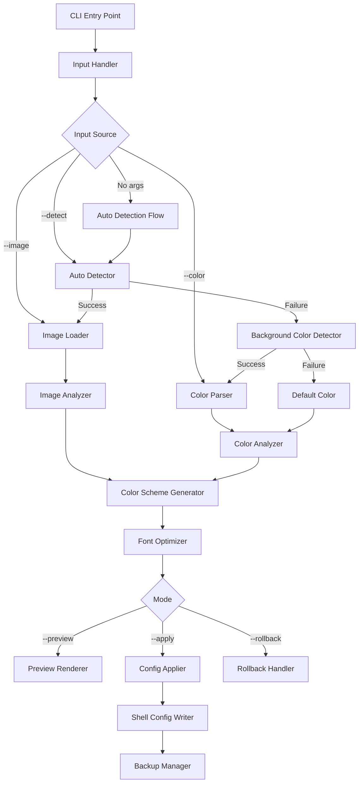

# 設計書

## 1. 概要

TWF（Terminal Wallpaper Fit）は、ターミナルの背景画像または背景色を解析し、視認性の高いカラースキームとフォント設定を自動生成するRust製CLIツールです。

本設計書では、以下の主要コンポーネントの設計を定義します：

- 背景画像/背景色の検出・解析エンジン
- カラースキーム生成エンジン
- 設定適用・永続化システム
- クロスプラットフォーム対応レイヤー
- CLIインターフェース

### 設計原則

1. **モジュール性**: 各機能を独立したモジュールとして実装し、テスト可能性と保守性を確保
2. **フォールバック戦略**: 画像検出→背景色検出→デフォルト値の順で処理を試行
3. **安全性**: ユーザー設定の変更前に確認とバックアップを実施
4. **パフォーマンス**: 画像解析は並列処理を活用し、5秒以内に完了
5. **エラーハンドリング**: すべてのエラーは適切にハンドリングし、ユーザーに明確なメッセージを提供

## 2. アーキテクチャ

### 2.1 システム構成



### 2.2 モジュール構成

```
twf/
├── src/
│   ├── main.rs                 # エントリーポイント
│   ├── cli.rs                  # CLI引数パース
│   ├── detector/
│   │   ├── mod.rs              # 検出モジュールのルート
│   │   ├── auto.rs             # 自動検出ロジック
│   │   ├── terminal.rs         # ターミナル種別判定
│   │   ├── iterm2.rs           # iTerm2設定パーサー
│   │   ├── alacritty.rs        # Alacritty設定パーサー
│   │   ├── windows_terminal.rs # Windows Terminal設定パーサー
│   │   ├── gnome_terminal.rs   # GNOME Terminal設定パーサー
│   │   ├── kitty.rs            # Kitty設定パーサー
│   │   ├── wezterm.rs          # WezTerm設定パーサー
│   │   └── bg_color.rs         # 背景色検出（OSC 11）
│   ├── analyzer/
│   │   ├── mod.rs              # 解析モジュールのルート
│   │   ├── image.rs            # 画像解析
│   │   ├── color.rs            # 色解析
│   │   └── contrast.rs         # コントラスト計算
│   ├── generator/
│   │   ├── mod.rs              # 生成モジュールのルート
│   │   ├── scheme.rs           # カラースキーム生成
│   │   └── font.rs             # フォント設定生成
│   ├── applier/
│   │   ├── mod.rs              # 適用モジュールのルート
│   │   ├── shell.rs            # シェル設定適用
│   │   ├── backup.rs           # バックアップ管理
│   │   └── rollback.rs         # ロールバック処理
│   ├── preview/
│   │   └── mod.rs              # プレビュー表示
│   ├── models/
│   │   └── mod.rs              # データモデル定義
│   └── utils/
│       ├── mod.rs              # ユーティリティのルート
│       ├── color_space.rs      # 色空間変換
│       └── file.rs             # ファイル操作
└── tests/
    ├── integration/            # 統合テスト
    └── property/               # プロパティベーステスト
```

## 3. コンポーネントとインターフェース

### 3.1 CLI Entry Point (`main.rs`, `cli.rs`)

CLIの引数をパースし、適切な処理フローに振り分けます。

```rust
// CLI引数の定義
pub struct CliArgs {
    /// 背景画像のパス（オプション）
    pub image: Option<PathBuf>,
    
    /// 自動検出を強制
    pub detect: bool,
    
    /// 背景色を直接指定（例: "#1e1e1e"）
    pub color: Option<String>,
    
    /// プレビューモード
    pub preview: bool,
    
    /// 設定を適用
    pub apply: bool,
    
    /// ロールバック
    pub rollback: bool,
    
    /// 詳細出力
    pub verbose: bool,
}

// メイン処理フロー
pub async fn run(args: CliArgs) -> Result<()> {
    // 1. 入力ソースの決定
    let input_source = determine_input_source(&args)?;
    
    // 2. 色情報の取得
    let color_info = match input_source {
        InputSource::ImagePath(path) => analyze_image(&path).await?,
        InputSource::AutoDetect => auto_detect_and_analyze().await?,
        InputSource::Color(color) => parse_color(&color)?,
    };
    
    // 3. カラースキームとフォント設定の生成
    let scheme = generate_color_scheme(&color_info)?;
    let font_config = generate_font_config(&color_info)?;
    
    // 4. モードに応じた処理
    match (args.preview, args.apply, args.rollback) {
        (true, _, _) => show_preview(&scheme, &font_config),
        (_, true, _) => apply_config(&scheme, &font_config).await,
        (_, _, true) => rollback_config().await,
        _ => show_preview(&scheme, &font_config), // デフォルトはプレビュー
    }
}
```

### 3.2 Auto Detector (`detector/auto.rs`)

ターミナルエミュレータの設定ファイルから背景画像パスを自動検出します。

```rust
pub struct AutoDetector {
    terminal_type: TerminalType,
}

impl AutoDetector {
    /// 現在のターミナルタイプを判定
    pub fn detect_terminal() -> Result<TerminalType> {
        // 環境変数から判定
        // TERM_PROGRAM, TERMINAL_EMULATOR, TERM 等をチェック
    }
    
    /// 背景画像パスを検出
    pub async fn detect_background_image(&self) -> Result<Option<PathBuf>> {
        match self.terminal_type {
            TerminalType::ITerm2 => detect_iterm2_background().await,
            TerminalType::Alacritty => detect_alacritty_background().await,
            TerminalType::WindowsTerminal => detect_windows_terminal_background().await,
            TerminalType::GnomeTerminal => detect_gnome_terminal_background().await,
            TerminalType::Kitty => detect_kitty_background().await,
            TerminalType::WezTerm => detect_wezterm_background().await,
            TerminalType::Unknown => Ok(None),
        }
    }
}
```

### 3.3 Background Color Detector (`detector/bg_color.rs`)

ANSIエスケープシーケンス（OSC 11）を使用してターミナルの背景色を検出します。

```rust
pub struct BgColorDetector {
    timeout: Duration,
}

impl BgColorDetector {
    /// ターミナルから背景色を取得
    /// OSC 11エスケープシーケンスを送信し、レスポンスをパース
    pub async fn detect_background_color(&self) -> Result<Option<Rgb>> {
        // 1. OSC 11クエリを送信: "\x1b]11;?\x07"
        // 2. タイムアウト付きでレスポンスを待機
        // 3. レスポンスをパース: "\x1b]11;rgb:RRRR/GGGG/BBBB\x07"
        // 4. RGB値を抽出して返す
    }
    
    /// レスポンスをパースしてRGB値を抽出
    fn parse_osc11_response(response: &str) -> Result<Rgb> {
        // "rgb:RRRR/GGGG/BBBB" 形式をパース
    }
}
```

### 3.4 Image Analyzer (`analyzer/image.rs`)

画像を読み込み、主要な色情報を抽出します。

```rust
pub struct ImageAnalyzer {
    sample_size: usize,  // サンプリングするピクセル数
}

impl ImageAnalyzer {
    /// 画像を解析して色情報を抽出
    pub async fn analyze(&self, image_path: &Path) -> Result<ColorInfo> {
        // 1. 画像を読み込み
        let img = image::open(image_path)?;
        
        // 2. リサイズ（パフォーマンス最適化）
        let img = img.resize(800, 600, image::imageops::FilterType::Lanczos3);
        
        // 3. ピクセルをサンプリング
        let pixels = self.sample_pixels(&img);
        
        // 4. 色空間変換（RGB → Lab）
        let lab_colors = pixels.iter()
            .map(|rgb| rgb_to_lab(*rgb))
            .collect::<Vec<_>>();
        
        // 5. K-meansクラスタリングで主要色を抽出
        let dominant_colors = kmeans_clustering(&lab_colors, 5);
        
        // 6. 明度を計算
        let average_lightness = calculate_average_lightness(&lab_colors);
        
        // 7. 彩度と色相を計算
        let (saturation, hue) = calculate_saturation_and_hue(&dominant_colors);
        
        Ok(ColorInfo {
            dominant_colors,
            average_lightness,
            saturation,
            hue,
            is_dark: average_lightness < 50.0,
        })
    }
    
    /// ピクセルをサンプリング（全ピクセルを処理しない）
    fn sample_pixels(&self, img: &DynamicImage) -> Vec<Rgb> {
        // グリッドサンプリングまたはランダムサンプリング
    }
}
```

### 3.5 Color Analyzer (`analyzer/color.rs`)

単一の背景色から色情報を抽出します。

```rust
pub struct ColorAnalyzer;

impl ColorAnalyzer {
    /// 背景色を解析
    pub fn analyze(bg_color: Rgb) -> ColorInfo {
        // 1. RGB → Lab変換
        let lab = rgb_to_lab(bg_color);
        
        // 2. 明度を取得
        let lightness = lab.l;
        
        // 3. 彩度と色相を計算
        let (saturation, hue) = calculate_saturation_and_hue_from_single_color(bg_color);
        
        ColorInfo {
            dominant_colors: vec![lab],
            average_lightness: lightness,
            saturation,
            hue,
            is_dark: lightness < 50.0,
        }
    }
}
```

### 3.6 Color Scheme Generator (`generator/scheme.rs`)

色情報からANSIカラースキームを生成します。

```rust
pub struct SchemeGenerator {
    contrast_ratio: f64,  // 最小コントラスト比（WCAG基準）
}

impl SchemeGenerator {
    /// カラースキームを生成
    pub fn generate(&self, color_info: &ColorInfo) -> Result<ColorScheme> {
        // 1. フォアグラウンドカラーを決定
        let foreground = self.calculate_foreground_color(color_info)?;
        
        // 2. ANSI 16色を生成
        let ansi_colors = self.generate_ansi_colors(color_info, &foreground)?;
        
        // 3. 256色パレットを生成（オプション）
        let palette_256 = self.generate_256_palette(color_info)?;
        
        // 4. True Colorサポート
        let supports_true_color = detect_true_color_support();
        
        Ok(ColorScheme {
            foreground,
            background: color_info.dominant_colors[0],
            ansi_colors,
            palette_256,
            supports_true_color,
        })
    }
    
    /// フォアグラウンドカラーを計算（コントラスト比を考慮）
    fn calculate_foreground_color(&self, color_info: &ColorInfo) -> Result<Rgb> {
        let bg = lab_to_rgb(color_info.dominant_colors[0]);
        
        // 明るい背景 → 暗いフォアグラウンド
        // 暗い背景 → 明るいフォアグラウンド
        let candidate = if color_info.is_dark {
            Rgb::new(240, 240, 240)  // ほぼ白
        } else {
            Rgb::new(30, 30, 30)     // ほぼ黒
        };
        
        // コントラスト比をチェック
        let contrast = calculate_contrast_ratio(bg, candidate);
        if contrast < self.contrast_ratio {
            // コントラスト比が不足している場合は調整
            self.adjust_for_contrast(bg, candidate, self.contrast_ratio)
        } else {
            Ok(candidate)
        }
    }
    
    /// ANSI 16色を生成
    fn generate_ansi_colors(&self, color_info: &ColorInfo, foreground: &Rgb) -> Result<AnsiColors> {
        // 背景の色相に基づいて、調和する色を生成
        // 基本8色: Black, Red, Green, Yellow, Blue, Magenta, Cyan, White
        // 明るい8色: Bright variants
    }
}
```

### 3.7 Font Optimizer (`generator/font.rs`)

背景画像の特性に基づいてフォント設定を最適化します。

```rust
pub struct FontOptimizer;

impl FontOptimizer {
    /// フォント設定を生成
    pub fn optimize(&self, color_info: &ColorInfo) -> FontConfig {
        // 1. 背景の明度に基づいてフォントウェイトを決定
        let weight = if color_info.is_dark {
            // 暗い背景では通常の太さ
            FontWeight::Normal
        } else {
            // 明るい背景では少し太め
            FontWeight::Medium
        };
        
        // 2. 背景の複雑さ（彩度）に基づいて調整
        let weight = if color_info.saturation > 50.0 {
            // 彩度が高い（複雑な背景）場合は太めに
            weight.increase()
        } else {
            weight
        };
        
        // 3. システムの等幅フォントを検出
        let available_fonts = detect_monospace_fonts();
        
        FontConfig {
            weight,
            recommended_fonts: available_fonts,
        }
    }
}
```

### 3.8 Config Applier (`applier/shell.rs`)

生成した設定をシェル設定ファイルに適用します。

```rust
pub struct ConfigApplier {
    shell_type: ShellType,
    backup_manager: BackupManager,
}

impl ConfigApplier {
    /// 設定を適用
    pub async fn apply(&self, scheme: &ColorScheme, font: &FontConfig) -> Result<()> {
        // 1. シェルタイプを検出
        let shell_type = detect_shell_type()?;
        
        // 2. 設定ファイルパスを取得
        let config_path = get_shell_config_path(&shell_type)?;
        
        // 3. バックアップを作成
        self.backup_manager.create_backup(&config_path).await?;
        
        // 4. ユーザーに確認
        if !confirm_apply()? {
            return Ok(());
        }
        
        // 5. 設定を書き込み
        self.write_config(&config_path, scheme, font).await?;
        
        // 6. 現在のセッションに適用
        self.apply_to_current_session(scheme).await?;
        
        Ok(())
    }
    
    /// シェル設定ファイルに書き込み
    async fn write_config(&self, path: &Path, scheme: &ColorScheme, font: &FontConfig) -> Result<()> {
        match self.shell_type {
            ShellType::Bash | ShellType::Zsh => {
                // ANSIエスケープシーケンスを生成
                let config_lines = generate_bash_config(scheme, font);
                append_to_config(path, &config_lines).await?;
            }
            ShellType::Fish => {
                let config_lines = generate_fish_config(scheme, font);
                append_to_config(path, &config_lines).await?;
            }
            ShellType::PowerShell => {
                let config_lines = generate_powershell_config(scheme, font);
                append_to_config(path, &config_lines).await?;
            }
        }
        Ok(())
    }
}
```

### 3.9 Preview Renderer (`preview/mod.rs`)

生成したカラースキームのプレビューを表示します。

```rust
pub struct PreviewRenderer;

impl PreviewRenderer {
    /// プレビューを表示
    pub fn render(&self, scheme: &ColorScheme, font: &FontConfig) {
        println!("=== TWF カラースキーム プレビュー ===\n");
        
        // 1. ANSI 16色のサンプル
        self.render_ansi_colors(&scheme.ansi_colors);
        
        // 2. 実際のコマンド出力例
        self.render_command_examples(scheme);
        
        // 3. フォント設定
        self.render_font_config(font);
        
        // 4. コントラスト比情報
        self.render_contrast_info(scheme);
    }
    
    fn render_ansi_colors(&self, colors: &AnsiColors) {
        println!("ANSI Colors:");
        // 各色のサンプルテキストを表示
    }
    
    fn render_command_examples(&self, scheme: &ColorScheme) {
        println!("\nCommand Examples:");
        // ls, git status, grep などの出力例を表示
    }
}
```

## 4. データモデル

### 4.1 コアデータ型

```rust
/// RGB色
#[derive(Debug, Clone, Copy, PartialEq)]
pub struct Rgb {
    pub r: u8,
    pub g: u8,
    pub b: u8,
}

/// Lab色空間（知覚的に均一な色空間）
#[derive(Debug, Clone, Copy, PartialEq)]
pub struct Lab {
    pub l: f64,  // 明度 (0-100)
    pub a: f64,  // 緑-赤軸 (-128 to 127)
    pub b: f64,  // 青-黄軸 (-128 to 127)
}

/// 色情報
#[derive(Debug, Clone)]
pub struct ColorInfo {
    /// 主要な色（Lab色空間）
    pub dominant_colors: Vec<Lab>,
    
    /// 平均明度 (0-100)
    pub average_lightness: f64,
    
    /// 彩度 (0-100)
    pub saturation: f64,
    
    /// 色相 (0-360)
    pub hue: f64,
    
    /// 暗い背景かどうか
    pub is_dark: bool,
}

/// ANSI 16色
#[derive(Debug, Clone)]
pub struct AnsiColors {
    pub black: Rgb,
    pub red: Rgb,
    pub green: Rgb,
    pub yellow: Rgb,
    pub blue: Rgb,
    pub magenta: Rgb,
    pub cyan: Rgb,
    pub white: Rgb,
    pub bright_black: Rgb,
    pub bright_red: Rgb,
    pub bright_green: Rgb,
    pub bright_yellow: Rgb,
    pub bright_blue: Rgb,
    pub bright_magenta: Rgb,
    pub bright_cyan: Rgb,
    pub bright_white: Rgb,
}

/// カラースキーム
#[derive(Debug, Clone)]
pub struct ColorScheme {
    pub foreground: Rgb,
    pub background: Lab,
    pub ansi_colors: AnsiColors,
    pub palette_256: Option<Vec<Rgb>>,
    pub supports_true_color: bool,
}

/// フォント設定
#[derive(Debug, Clone)]
pub struct FontConfig {
    pub weight: FontWeight,
    pub recommended_fonts: Vec<String>,
}

#[derive(Debug, Clone, Copy, PartialEq, Eq)]
pub enum FontWeight {
    Light,
    Normal,
    Medium,
    Bold,
}

impl FontWeight {
    pub fn increase(self) -> Self {
        match self {
            FontWeight::Light => FontWeight::Normal,
            FontWeight::Normal => FontWeight::Medium,
            FontWeight::Medium => FontWeight::Bold,
            FontWeight::Bold => FontWeight::Bold,
        }
    }
}
```

### 4.2 ターミナル関連の型

```rust
/// ターミナルタイプ
#[derive(Debug, Clone, Copy, PartialEq, Eq)]
pub enum TerminalType {
    ITerm2,
    Alacritty,
    WindowsTerminal,
    GnomeTerminal,
    Kitty,
    WezTerm,
    Unknown,
}

/// シェルタイプ
#[derive(Debug, Clone, Copy, PartialEq, Eq)]
pub enum ShellType {
    Bash,
    Zsh,
    Fish,
    PowerShell,
}

/// 入力ソース
#[derive(Debug, Clone)]
pub enum InputSource {
    /// 画像パスが指定された
    ImagePath(PathBuf),
    
    /// 自動検出
    AutoDetect,
    
    /// 背景色が指定された
    Color(String),
}
```

### 4.3 設定とバックアップ

```rust
/// バックアップ情報
#[derive(Debug, Clone, Serialize, Deserialize)]
pub struct BackupInfo {
    pub original_path: PathBuf,
    pub backup_path: PathBuf,
    pub timestamp: DateTime<Utc>,
    pub checksum: String,
}

/// アプリケーション設定
#[derive(Debug, Clone, Serialize, Deserialize)]
pub struct AppConfig {
    /// バックアップディレクトリ
    pub backup_dir: PathBuf,
    
    /// 最小コントラスト比
    pub min_contrast_ratio: f64,
    
    /// サンプリングサイズ
    pub sample_size: usize,
    
    /// タイムアウト（背景色検出）
    pub detection_timeout_ms: u64,
}

impl Default for AppConfig {
    fn default() -> Self {
        Self {
            backup_dir: dirs::config_dir()
                .unwrap_or_else(|| PathBuf::from("."))
                .join("twf")
                .join("backups"),
            min_contrast_ratio: 4.5,  // WCAG AA基準
            sample_size: 10000,
            detection_timeout_ms: 1000,
        }
    }
}
```


## 5. 処理一覧

| 処理ID | 処理名 | 説明 | 入力 | 出力 |
|--------|--------|------|------|------|
| P-01 | CLI引数パース | コマンドライン引数を解析 | `Vec<String>` | `CliArgs` |
| P-02 | 入力ソース決定 | 画像パス/自動検出/背景色のいずれかを決定 | `CliArgs` | `InputSource` |
| P-03 | ターミナル種別判定 | 現在のターミナルエミュレータを判定 | 環境変数 | `TerminalType` |
| P-04 | 背景画像自動検出 | ターミナル設定から背景画像パスを検出 | `TerminalType` | `Option<PathBuf>` |
| P-05 | 背景色検出 | OSC 11で背景色を取得 | - | `Option<Rgb>` |
| P-06 | 画像読み込み | 画像ファイルを読み込み | `PathBuf` | `DynamicImage` |
| P-07 | 画像解析 | 画像から色情報を抽出 | `DynamicImage` | `ColorInfo` |
| P-08 | 色解析 | 単一色から色情報を抽出 | `Rgb` | `ColorInfo` |
| P-09 | カラースキーム生成 | 色情報からANSIカラースキームを生成 | `ColorInfo` | `ColorScheme` |
| P-10 | フォント設定生成 | 色情報からフォント設定を生成 | `ColorInfo` | `FontConfig` |
| P-11 | コントラスト比計算 | 2色間のコントラスト比を計算 | `(Rgb, Rgb)` | `f64` |
| P-12 | プレビュー表示 | カラースキームをターミナルに表示 | `(ColorScheme, FontConfig)` | - |
| P-13 | シェル種別検出 | 現在のシェルを判定 | 環境変数 | `ShellType` |
| P-14 | 設定ファイルパス取得 | シェル設定ファイルのパスを取得 | `ShellType` | `PathBuf` |
| P-15 | バックアップ作成 | 設定ファイルをバックアップ | `PathBuf` | `BackupInfo` |
| P-16 | 設定書き込み | シェル設定ファイルに書き込み | `(PathBuf, ColorScheme, FontConfig)` | `Result<()>` |
| P-17 | 現在セッション適用 | 現在のターミナルセッションに適用 | `ColorScheme` | `Result<()>` |
| P-18 | ロールバック | バックアップから設定を復元 | `BackupInfo` | `Result<()>` |
| P-19 | 色空間変換（RGB→Lab） | RGBをLab色空間に変換 | `Rgb` | `Lab` |
| P-20 | 色空間変換（Lab→RGB） | LabをRGB色空間に変換 | `Lab` | `Rgb` |
| P-21 | K-meansクラスタリング | 色をクラスタリングして主要色を抽出 | `Vec<Lab>` | `Vec<Lab>` |

## 6. 処理詳細

### 6.1 P-02: 入力ソース決定

**目的**: ユーザーの入力に基づいて、どの方法で背景情報を取得するかを決定します。

**アルゴリズム**:
```
function determine_input_source(args: CliArgs) -> InputSource:
    if args.image is Some:
        return InputSource::ImagePath(args.image)
    
    if args.color is Some:
        return InputSource::Color(args.color)
    
    if args.detect or (args.image is None and args.color is None):
        return InputSource::AutoDetect
    
    return InputSource::AutoDetect  // デフォルト
```

**エラーハンドリング**:
- 画像パスが存在しない場合: エラーメッセージを表示し、自動検出にフォールバック
- 色の形式が不正な場合: エラーメッセージを表示し、終了

### 6.2 P-03: ターミナル種別判定

**目的**: 現在実行中のターミナルエミュレータを判定します。

**アルゴリズム**:
```
function detect_terminal() -> TerminalType:
    // 環境変数をチェック（優先度順）
    if env("TERM_PROGRAM") == "iTerm.app":
        return TerminalType::ITerm2
    
    if env("TERM_PROGRAM") == "WezTerm":
        return TerminalType::WezTerm
    
    if env("ALACRITTY_SOCKET") is set or env("ALACRITTY_LOG") is set:
        return TerminalType::Alacritty
    
    if env("WT_SESSION") is set:
        return TerminalType::WindowsTerminal
    
    if env("GNOME_TERMINAL_SERVICE") is set:
        return TerminalType::GnomeTerminal
    
    if env("KITTY_WINDOW_ID") is set:
        return TerminalType::Kitty
    
    return TerminalType::Unknown
```

**フォールバック**:
- 判定できない場合は `Unknown` を返し、背景色検出にフォールバック

### 6.3 P-04: 背景画像自動検出

**目的**: ターミナルエミュレータの設定ファイルから背景画像のパスを検出します。

**アルゴリズム（iTerm2の例）**:
```
function detect_iterm2_background() -> Option<PathBuf>:
    // 1. plistファイルのパスを取得
    let plist_path = home_dir().join("Library/Preferences/com.googlecode.iterm2.plist")
    
    if not plist_path.exists():
        return None
    
    // 2. plistをパース
    let plist = parse_plist(plist_path)?
    
    // 3. 現在のプロファイルを取得
    let current_profile = plist.get("Default Bookmark Guid")?
    
    // 4. プロファイルから背景画像パスを取得
    let profiles = plist.get("New Bookmarks")?
    for profile in profiles:
        if profile.get("Guid") == current_profile:
            let bg_image_path = profile.get("Background Image Location")?
            if bg_image_path.exists():
                return Some(bg_image_path)
    
    return None
```

**アルゴリズム（Alacrittyの例）**:
```
function detect_alacritty_background() -> Option<PathBuf>:
    // 1. 設定ファイルのパスを取得（YAML/TOML両対応）
    let config_paths = [
        config_dir().join("alacritty/alacritty.yml"),
        config_dir().join("alacritty/alacritty.toml"),
    ]
    
    for config_path in config_paths:
        if not config_path.exists():
            continue
        
        // 2. 設定ファイルをパース
        let config = parse_config(config_path)?
        
        // 3. 背景画像パスを取得
        // YAML: window.decorations.background_image
        // TOML: [window.decorations] background_image = "..."
        let bg_image_path = config.get("window.decorations.background_image")?
        
        if bg_image_path.exists():
            return Some(bg_image_path)
    
    return None
```

**エラーハンドリング**:
- 設定ファイルが存在しない: `None` を返す
- パースエラー: ログに記録し、`None` を返す
- 画像パスが存在しない: `None` を返す

### 6.4 P-05: 背景色検出

**目的**: ANSIエスケープシーケンス（OSC 11）を使用してターミナルの背景色を検出します。

**アルゴリズム**:
```
function detect_background_color(timeout: Duration) -> Option<Rgb>:
    // 1. 標準入力を非カノニカルモードに設定
    let original_termios = setup_raw_mode()?
    
    // 2. OSC 11クエリを送信
    print("\x1b]11;?\x07")
    flush_stdout()
    
    // 3. タイムアウト付きでレスポンスを待機
    let response = read_with_timeout(timeout)?
    
    // 4. 元のターミナル設定に戻す
    restore_termios(original_termios)
    
    // 5. レスポンスをパース
    if response.starts_with("\x1b]11;rgb:"):
        return parse_osc11_response(response)
    
    return None

function parse_osc11_response(response: &str) -> Option<Rgb>:
    // レスポンス形式: "\x1b]11;rgb:RRRR/GGGG/BBBB\x07"
    let parts = response.strip_prefix("\x1b]11;rgb:")?
                        .strip_suffix("\x07")?
                        .split('/')
                        .collect::<Vec<_>>()
    
    if parts.len() != 3:
        return None
    
    // 16進数をパース（4桁 → 8ビット）
    let r = u16::from_str_radix(parts[0], 16).ok()? / 256
    let g = u16::from_str_radix(parts[1], 16).ok()? / 256
    let b = u16::from_str_radix(parts[2], 16).ok()? / 256
    
    return Some(Rgb::new(r as u8, g as u8, b as u8))
```

**エラーハンドリング**:
- タイムアウト: `None` を返す
- パースエラー: `None` を返す
- ターミナルが非対応: `None` を返す

### 6.5 P-07: 画像解析

**目的**: 画像から主要な色情報を抽出します。

**アルゴリズム**:
```
function analyze_image(image_path: PathBuf) -> ColorInfo:
    // 1. 画像を読み込み
    let img = image::open(image_path)?
    
    // 2. パフォーマンス最適化のためリサイズ
    let img = img.resize(800, 600, FilterType::Lanczos3)
    
    // 3. ピクセルをサンプリング（全ピクセルは処理しない）
    let pixels = sample_pixels(&img, sample_size=10000)
    
    // 4. RGB → Lab変換
    let lab_colors = pixels.map(|rgb| rgb_to_lab(rgb))
    
    // 5. K-meansクラスタリングで主要色を抽出（k=5）
    let dominant_colors = kmeans_clustering(&lab_colors, k=5, max_iterations=100)
    
    // 6. 平均明度を計算
    let average_lightness = lab_colors.iter().map(|c| c.l).sum() / lab_colors.len()
    
    // 7. 彩度を計算（Lab色空間のa, b成分から）
    let saturation = calculate_saturation(&dominant_colors)
    
    // 8. 色相を計算
    let hue = calculate_hue(&dominant_colors)
    
    // 9. 暗い背景かどうかを判定
    let is_dark = average_lightness < 50.0
    
    return ColorInfo {
        dominant_colors,
        average_lightness,
        saturation,
        hue,
        is_dark,
    }

function sample_pixels(img: &DynamicImage, sample_size: usize) -> Vec<Rgb>:
    let (width, height) = img.dimensions()
    let total_pixels = width * height
    
    if total_pixels <= sample_size:
        // 全ピクセルを使用
        return img.pixels().map(|p| Rgb::from(p)).collect()
    
    // グリッドサンプリング
    let step = (total_pixels as f64 / sample_size as f64).sqrt().ceil() as u32
    let mut samples = Vec::new()
    
    for y in (0..height).step_by(step as usize):
        for x in (0..width).step_by(step as usize):
            let pixel = img.get_pixel(x, y)
            samples.push(Rgb::from(pixel))
    
    return samples

function kmeans_clustering(colors: &[Lab], k: usize, max_iterations: usize) -> Vec<Lab>:
    // 1. ランダムに初期中心を選択
    let mut centroids = randomly_select_k_colors(colors, k)
    
    for iteration in 0..max_iterations:
        // 2. 各色を最も近い中心に割り当て
        let clusters = assign_to_nearest_centroid(colors, &centroids)
        
        // 3. 新しい中心を計算
        let new_centroids = calculate_new_centroids(&clusters)
        
        // 4. 収束判定
        if centroids_converged(&centroids, &new_centroids):
            break
        
        centroids = new_centroids
    
    return centroids
```

**パフォーマンス最適化**:
- 画像を800x600にリサイズして処理量を削減
- グリッドサンプリングで処理するピクセル数を制限
- K-meansの反復回数を100回に制限

### 6.6 P-09: カラースキーム生成

**目的**: 色情報からANSIカラースキームを生成します。

**アルゴリズム**:
```
function generate_color_scheme(color_info: &ColorInfo, min_contrast: f64) -> ColorScheme:
    // 1. 背景色を取得（最も支配的な色）
    let background = color_info.dominant_colors[0]
    let bg_rgb = lab_to_rgb(background)
    
    // 2. フォアグラウンドカラーを計算
    let foreground = calculate_foreground_color(bg_rgb, color_info.is_dark, min_contrast)
    
    // 3. ANSI 16色を生成
    let ansi_colors = generate_ansi_colors(color_info, foreground, bg_rgb)
    
    // 4. 256色パレットを生成（オプション）
    let palette_256 = if supports_256_colors():
        Some(generate_256_palette(color_info))
    else:
        None
    
    // 5. True Colorサポートを検出
    let supports_true_color = detect_true_color_support()
    
    return ColorScheme {
        foreground,
        background,
        ansi_colors,
        palette_256,
        supports_true_color,
    }

function calculate_foreground_color(bg: Rgb, is_dark: bool, min_contrast: f64) -> Rgb:
    // 基本候補を決定
    let candidate = if is_dark:
        Rgb::new(240, 240, 240)  // 明るいフォアグラウンド
    else:
        Rgb::new(30, 30, 30)     // 暗いフォアグラウンド
    
    // コントラスト比をチェック
    let contrast = calculate_contrast_ratio(bg, candidate)
    
    if contrast >= min_contrast:
        return candidate
    
    // コントラスト比が不足している場合は調整
    return adjust_for_contrast(bg, candidate, min_contrast)

function adjust_for_contrast(bg: Rgb, fg: Rgb, target_contrast: f64) -> Rgb:
    // 二分探索でコントラスト比を満たす色を見つける
    let bg_lab = rgb_to_lab(bg)
    let fg_lab = rgb_to_lab(fg)
    
    // 明度を調整
    let direction = if fg_lab.l > bg_lab.l { 1.0 } else { -1.0 }
    
    for step in 0..100:
        let adjusted_l = fg_lab.l + direction * step as f64
        let adjusted_lab = Lab { l: adjusted_l, a: fg_lab.a, b: fg_lab.b }
        let adjusted_rgb = lab_to_rgb(adjusted_lab)
        
        let contrast = calculate_contrast_ratio(bg, adjusted_rgb)
        if contrast >= target_contrast:
            return adjusted_rgb
    
    // 最大限調整しても不足する場合は、白または黒を返す
    return if direction > 0.0 { Rgb::new(255, 255, 255) } else { Rgb::new(0, 0, 0) }

function generate_ansi_colors(color_info: &ColorInfo, fg: Rgb, bg: Rgb) -> AnsiColors:
    // 背景の色相に基づいて調和する色を生成
    let base_hue = color_info.hue
    
    // 基本8色を生成（色相環を使用）
    let black = if color_info.is_dark { Rgb::new(40, 40, 40) } else { Rgb::new(0, 0, 0) }
    let white = if color_info.is_dark { Rgb::new(220, 220, 220) } else { Rgb::new(255, 255, 255) }
    
    // 色相環から調和する色を選択
    let red = generate_color_from_hue(base_hue + 0.0, 60.0, 50.0)    // 赤
    let green = generate_color_from_hue(base_hue + 120.0, 60.0, 50.0) // 緑
    let yellow = generate_color_from_hue(base_hue + 60.0, 60.0, 60.0) // 黄
    let blue = generate_color_from_hue(base_hue + 240.0, 60.0, 50.0)  // 青
    let magenta = generate_color_from_hue(base_hue + 300.0, 60.0, 50.0) // マゼンタ
    let cyan = generate_color_from_hue(base_hue + 180.0, 60.0, 60.0)  // シアン
    
    // 明るいバリアントを生成（明度を上げる）
    let bright_black = lighten(black, 30.0)
    let bright_red = lighten(red, 20.0)
    let bright_green = lighten(green, 20.0)
    let bright_yellow = lighten(yellow, 20.0)
    let bright_blue = lighten(blue, 20.0)
    let bright_magenta = lighten(magenta, 20.0)
    let bright_cyan = lighten(cyan, 20.0)
    let bright_white = white
    
    return AnsiColors {
        black, red, green, yellow, blue, magenta, cyan, white,
        bright_black, bright_red, bright_green, bright_yellow,
        bright_blue, bright_magenta, bright_cyan, bright_white,
    }
```

### 6.7 P-11: コントラスト比計算

**目的**: WCAG 2.1基準に基づいて2色間のコントラスト比を計算します。

**アルゴリズム**:
```
function calculate_contrast_ratio(color1: Rgb, color2: Rgb) -> f64:
    // 1. 相対輝度を計算
    let l1 = calculate_relative_luminance(color1)
    let l2 = calculate_relative_luminance(color2)
    
    // 2. コントラスト比を計算
    let lighter = max(l1, l2)
    let darker = min(l1, l2)
    
    return (lighter + 0.05) / (darker + 0.05)

function calculate_relative_luminance(color: Rgb) -> f64:
    // sRGB → 線形RGB変換
    let r = srgb_to_linear(color.r as f64 / 255.0)
    let g = srgb_to_linear(color.g as f64 / 255.0)
    let b = srgb_to_linear(color.b as f64 / 255.0)
    
    // 相対輝度の計算（ITU-R BT.709）
    return 0.2126 * r + 0.7152 * g + 0.0722 * b

function srgb_to_linear(c: f64) -> f64:
    if c <= 0.03928:
        return c / 12.92
    else:
        return ((c + 0.055) / 1.055).powf(2.4)
```

**WCAG基準**:
- AA基準: 4.5:1以上（通常テキスト）
- AAA基準: 7:1以上（通常テキスト）

### 6.8 P-16: 設定書き込み

**目的**: 生成したカラースキームをシェル設定ファイルに書き込みます。

**アルゴリズム（Bash/Zshの例）**:
```
function write_bash_config(path: PathBuf, scheme: &ColorScheme, font: &FontConfig) -> Result<()>:
    // 1. 設定ブロックを生成
    let config_block = generate_bash_config_block(scheme, font)
    
    // 2. 既存の設定ブロックを削除（あれば）
    remove_existing_twf_block(path)?
    
    // 3. 新しい設定ブロックを追加
    append_to_file(path, config_block)?
    
    Ok(())

function generate_bash_config_block(scheme: &ColorScheme, font: &FontConfig) -> String:
    let mut lines = Vec::new()
    
    lines.push("# === TWF Generated Config ===")
    lines.push("# Generated at: {timestamp}")
    lines.push("")
    
    // ANSIエスケープシーケンスを生成
    lines.push("# Set ANSI colors")
    lines.push(format!("export ANSI_BLACK='\\e[30m'"))
    lines.push(format!("export ANSI_RED='\\e[31m'"))
    // ... 他の色も同様
    
    // フォント設定（ターミナルエミュレータ依存）
    lines.push("")
    lines.push("# Recommended font settings:")
    lines.push(format!("# Font weight: {:?}", font.weight))
    lines.push(format!("# Recommended fonts: {}", font.recommended_fonts.join(", ")))
    
    lines.push("")
    lines.push("# === End TWF Config ===")
    
    return lines.join("\n")
```

### 6.9 P-19/P-20: 色空間変換

**目的**: RGBとLab色空間を相互変換します。

**アルゴリズム（RGB → Lab）**:
```
function rgb_to_lab(rgb: Rgb) -> Lab:
    // 1. RGB → XYZ変換
    let xyz = rgb_to_xyz(rgb)
    
    // 2. XYZ → Lab変換
    return xyz_to_lab(xyz)

function rgb_to_xyz(rgb: Rgb) -> Xyz:
    // sRGB → 線形RGB
    let r = srgb_to_linear(rgb.r as f64 / 255.0)
    let g = srgb_to_linear(rgb.g as f64 / 255.0)
    let b = srgb_to_linear(rgb.b as f64 / 255.0)
    
    // 線形RGB → XYZ（D65白色点）
    let x = r * 0.4124564 + g * 0.3575761 + b * 0.1804375
    let y = r * 0.2126729 + g * 0.7151522 + b * 0.0721750
    let z = r * 0.0193339 + g * 0.1191920 + b * 0.9503041
    
    return Xyz { x, y, z }

function xyz_to_lab(xyz: Xyz) -> Lab:
    // D65白色点で正規化
    let xn = 0.95047
    let yn = 1.00000
    let zn = 1.08883
    
    let fx = lab_f(xyz.x / xn)
    let fy = lab_f(xyz.y / yn)
    let fz = lab_f(xyz.z / zn)
    
    let l = 116.0 * fy - 16.0
    let a = 500.0 * (fx - fy)
    let b = 200.0 * (fy - fz)
    
    return Lab { l, a, b }

function lab_f(t: f64) -> f64:
    let delta = 6.0 / 29.0
    if t > delta.powi(3):
        return t.powf(1.0 / 3.0)
    else:
        return t / (3.0 * delta.powi(2)) + 4.0 / 29.0
```

**アルゴリズム（Lab → RGB）**:
```
function lab_to_rgb(lab: Lab) -> Rgb:
    // 1. Lab → XYZ変換
    let xyz = lab_to_xyz(lab)
    
    // 2. XYZ → RGB変換
    return xyz_to_rgb(xyz)

function lab_to_xyz(lab: Lab) -> Xyz:
    let fy = (lab.l + 16.0) / 116.0
    let fx = lab.a / 500.0 + fy
    let fz = fy - lab.b / 200.0
    
    let xn = 0.95047
    let yn = 1.00000
    let zn = 1.08883
    
    let x = xn * lab_f_inv(fx)
    let y = yn * lab_f_inv(fy)
    let z = zn * lab_f_inv(fz)
    
    return Xyz { x, y, z }

function lab_f_inv(t: f64) -> f64:
    let delta = 6.0 / 29.0
    if t > delta:
        return t.powi(3)
    else:
        return 3.0 * delta.powi(2) * (t - 4.0 / 29.0)

function xyz_to_rgb(xyz: Xyz) -> Rgb:
    // XYZ → 線形RGB
    let r = xyz.x *  3.2404542 + xyz.y * -1.5371385 + xyz.z * -0.4985314
    let g = xyz.x * -0.9692660 + xyz.y *  1.8760108 + xyz.z *  0.0415560
    let b = xyz.x *  0.0556434 + xyz.y * -0.2040259 + xyz.z *  1.0572252
    
    // 線形RGB → sRGB
    let r = linear_to_srgb(r) * 255.0
    let g = linear_to_srgb(g) * 255.0
    let b = linear_to_srgb(b) * 255.0
    
    // クランプ
    let r = r.clamp(0.0, 255.0) as u8
    let g = g.clamp(0.0, 255.0) as u8
    let b = b.clamp(0.0, 255.0) as u8
    
    return Rgb { r, g, b }

function linear_to_srgb(c: f64) -> f64:
    if c <= 0.0031308:
        return 12.92 * c
    else:
        return 1.055 * c.powf(1.0 / 2.4) - 0.055
```


## 7. API設計

### 7.1 CLIコマンドインターフェース

#### 基本コマンド

```bash
# 自動検出モード（デフォルト）
twf

# 画像パスを指定
twf --image ~/Pictures/wallpaper.png

# 背景色を直接指定
twf --color "#1e1e1e"

# 自動検出を強制
twf --detect

# プレビューのみ表示（設定を適用しない）
twf --preview

# 設定を適用
twf --apply

# 設定をロールバック
twf --rollback

# 詳細出力
twf --verbose

# ヘルプを表示
twf --help

# バージョンを表示
twf --version
```

#### オプション詳細

| オプション | 短縮形 | 引数 | 説明 | デフォルト |
|-----------|--------|------|------|-----------|
| `--image` | `-i` | `<PATH>` | 背景画像のパスを指定。自動検出が失敗した場合や事前にテストしたい場合に使用 | なし |
| `--detect` | `-d` | なし | 自動検出を強制。画像パスや背景色が指定されていても自動検出を試みる | false |
| `--color` | `-c` | `<COLOR>` | 背景色を直接指定（例: "#1e1e1e", "rgb(30,30,30)"）。背景画像を使用していない場合や特定の背景色に合わせたい場合に使用 | なし |
| `--preview` | `-p` | なし | プレビューのみ表示し、設定を適用しない | false |
| `--apply` | `-a` | なし | 設定をシェル設定ファイルに書き込み、現在のセッションに適用 | false |
| `--rollback` | `-r` | なし | 最後のバックアップから設定を復元 | false |
| `--verbose` | `-v` | なし | 詳細な出力を表示（検出プロセス、色解析の詳細など） | false |
| `--help` | `-h` | なし | ヘルプメッセージを表示 | - |
| `--version` | `-V` | なし | バージョン情報を表示 | - |

#### 実行例

```bash
# 例1: 自動検出してプレビュー
$ twf
🔍 ターミナルを検出中...
✓ iTerm2を検出しました
🔍 背景画像を検出中...
✓ 背景画像を検出: ~/Pictures/wallpaper.png
🎨 画像を解析中...
✓ 解析完了

=== TWF カラースキーム プレビュー ===
[プレビュー表示]

設定を適用しますか？ (y/n): 

# 例2: 画像を指定して即座に適用
$ twf --image ~/Pictures/my-wallpaper.jpg --apply
🎨 画像を解析中...
✓ 解析完了
💾 設定をバックアップ中...
✓ バックアップ完了: ~/.config/twf/backups/backup_20240115_123456.tar.gz
✏️  設定を適用中...
✓ 設定を適用しました

# 例3: 背景色を指定
$ twf --color "#282c34" --preview
🎨 背景色を解析中...
✓ 解析完了

=== TWF カラースキーム プレビュー ===
[プレビュー表示]

# 例4: ロールバック
$ twf --rollback
🔄 設定をロールバック中...
✓ ロールバック完了: ~/.config/twf/backups/backup_20240115_123456.tar.gz
```

### 7.2 内部関数インターフェース

#### 7.2.1 検出モジュール (`detector`)

```rust
/// ターミナル種別を検出
pub fn detect_terminal() -> Result<TerminalType>;

/// 背景画像パスを自動検出
pub async fn detect_background_image(terminal_type: TerminalType) -> Result<Option<PathBuf>>;

/// 背景色を検出（OSC 11）
pub async fn detect_background_color(timeout: Duration) -> Result<Option<Rgb>>;

/// iTerm2の背景画像を検出
pub async fn detect_iterm2_background() -> Result<Option<PathBuf>>;

/// Alacrittyの背景画像を検出
pub async fn detect_alacritty_background() -> Result<Option<PathBuf>>;

/// Windows Terminalの背景画像を検出
pub async fn detect_windows_terminal_background() -> Result<Option<PathBuf>>;

/// GNOME Terminalの背景画像を検出
pub async fn detect_gnome_terminal_background() -> Result<Option<PathBuf>>;

/// Kittyの背景画像を検出
pub async fn detect_kitty_background() -> Result<Option<PathBuf>>;

/// WezTermの背景画像を検出
pub async fn detect_wezterm_background() -> Result<Option<PathBuf>>;
```

#### 7.2.2 解析モジュール (`analyzer`)

```rust
/// 画像を解析して色情報を抽出
pub async fn analyze_image(image_path: &Path, config: &AnalyzerConfig) -> Result<ColorInfo>;

/// 背景色を解析して色情報を抽出
pub fn analyze_color(bg_color: Rgb) -> ColorInfo;

/// コントラスト比を計算
pub fn calculate_contrast_ratio(color1: Rgb, color2: Rgb) -> f64;

/// 相対輝度を計算
pub fn calculate_relative_luminance(color: Rgb) -> f64;

/// ピクセルをサンプリング
pub fn sample_pixels(img: &DynamicImage, sample_size: usize) -> Vec<Rgb>;

/// K-meansクラスタリング
pub fn kmeans_clustering(colors: &[Lab], k: usize, max_iterations: usize) -> Vec<Lab>;
```

#### 7.2.3 生成モジュール (`generator`)

```rust
/// カラースキームを生成
pub fn generate_color_scheme(color_info: &ColorInfo, config: &GeneratorConfig) -> Result<ColorScheme>;

/// フォアグラウンドカラーを計算
pub fn calculate_foreground_color(bg: Rgb, is_dark: bool, min_contrast: f64) -> Result<Rgb>;

/// コントラスト比を満たすように色を調整
pub fn adjust_for_contrast(bg: Rgb, fg: Rgb, target_contrast: f64) -> Rgb;

/// ANSI 16色を生成
pub fn generate_ansi_colors(color_info: &ColorInfo, fg: Rgb, bg: Rgb) -> AnsiColors;

/// 256色パレットを生成
pub fn generate_256_palette(color_info: &ColorInfo) -> Vec<Rgb>;

/// 色相から色を生成
pub fn generate_color_from_hue(hue: f64, saturation: f64, lightness: f64) -> Rgb;

/// 色を明るくする
pub fn lighten(color: Rgb, amount: f64) -> Rgb;

/// フォント設定を生成
pub fn generate_font_config(color_info: &ColorInfo) -> FontConfig;

/// システムの等幅フォントを検出
pub fn detect_monospace_fonts() -> Vec<String>;
```

#### 7.2.4 適用モジュール (`applier`)

```rust
/// 設定を適用
pub async fn apply_config(scheme: &ColorScheme, font: &FontConfig, config: &AppConfig) -> Result<()>;

/// シェルタイプを検出
pub fn detect_shell_type() -> Result<ShellType>;

/// シェル設定ファイルのパスを取得
pub fn get_shell_config_path(shell_type: &ShellType) -> Result<PathBuf>;

/// 設定ファイルに書き込み
pub async fn write_config(path: &Path, scheme: &ColorScheme, font: &FontConfig, shell_type: &ShellType) -> Result<()>;

/// 現在のセッションに適用
pub async fn apply_to_current_session(scheme: &ColorScheme) -> Result<()>;

/// バックアップを作成
pub async fn create_backup(path: &Path, backup_dir: &Path) -> Result<BackupInfo>;

/// ロールバック
pub async fn rollback(backup_info: &BackupInfo) -> Result<()>;

/// 最新のバックアップを取得
pub fn get_latest_backup(backup_dir: &Path) -> Result<Option<BackupInfo>>;

/// Bash/Zsh設定を生成
pub fn generate_bash_config(scheme: &ColorScheme, font: &FontConfig) -> String;

/// Fish設定を生成
pub fn generate_fish_config(scheme: &ColorScheme, font: &FontConfig) -> String;

/// PowerShell設定を生成
pub fn generate_powershell_config(scheme: &ColorScheme, font: &FontConfig) -> String;
```

#### 7.2.5 プレビューモジュール (`preview`)

```rust
/// プレビューを表示
pub fn render_preview(scheme: &ColorScheme, font: &FontConfig);

/// ANSI色のサンプルを表示
pub fn render_ansi_colors(colors: &AnsiColors);

/// コマンド出力例を表示
pub fn render_command_examples(scheme: &ColorScheme);

/// フォント設定を表示
pub fn render_font_config(font: &FontConfig);

/// コントラスト比情報を表示
pub fn render_contrast_info(scheme: &ColorScheme);
```

#### 7.2.6 ユーティリティモジュール (`utils`)

```rust
/// RGB → Lab変換
pub fn rgb_to_lab(rgb: Rgb) -> Lab;

/// Lab → RGB変換
pub fn lab_to_rgb(lab: Lab) -> Rgb;

/// RGB → XYZ変換
pub fn rgb_to_xyz(rgb: Rgb) -> Xyz;

/// XYZ → RGB変換
pub fn xyz_to_rgb(xyz: Xyz) -> Rgb;

/// XYZ → Lab変換
pub fn xyz_to_lab(xyz: Xyz) -> Lab;

/// Lab → XYZ変換
pub fn lab_to_xyz(lab: Lab) -> Xyz;

/// sRGB → 線形RGB変換
pub fn srgb_to_linear(c: f64) -> f64;

/// 線形RGB → sRGB変換
pub fn linear_to_srgb(c: f64) -> f64;

/// 彩度を計算
pub fn calculate_saturation(colors: &[Lab]) -> f64;

/// 色相を計算
pub fn calculate_hue(colors: &[Lab]) -> f64;

/// True Colorサポートを検出
pub fn detect_true_color_support() -> bool;

/// 256色サポートを検出
pub fn supports_256_colors() -> bool;

/// ファイルに追記
pub async fn append_to_file(path: &Path, content: &str) -> Result<()>;

/// 既存のTWF設定ブロックを削除
pub async fn remove_existing_twf_block(path: &Path) -> Result<()>;

/// ユーザーに確認を求める
pub fn confirm_apply() -> Result<bool>;
```

### 7.3 エラー型

```rust
/// TWFのエラー型
#[derive(Debug, thiserror::Error)]
pub enum TwfError {
    #[error("画像の読み込みに失敗しました: {0}")]
    ImageLoadError(String),
    
    #[error("画像の解析に失敗しました: {0}")]
    ImageAnalysisError(String),
    
    #[error("背景画像が検出できませんでした")]
    BackgroundImageNotFound,
    
    #[error("背景色が検出できませんでした")]
    BackgroundColorNotFound,
    
    #[error("ターミナルタイプを判定できませんでした")]
    TerminalTypeUnknown,
    
    #[error("シェルタイプを判定できませんでした")]
    ShellTypeUnknown,
    
    #[error("設定ファイルが見つかりません: {0}")]
    ConfigFileNotFound(PathBuf),
    
    #[error("設定ファイルの読み込みに失敗しました: {0}")]
    ConfigReadError(String),
    
    #[error("設定ファイルの書き込みに失敗しました: {0}")]
    ConfigWriteError(String),
    
    #[error("バックアップの作成に失敗しました: {0}")]
    BackupError(String),
    
    #[error("ロールバックに失敗しました: {0}")]
    RollbackError(String),
    
    #[error("色の変換に失敗しました: {0}")]
    ColorConversionError(String),
    
    #[error("コントラスト比が不足しています: {0:.2} (最小: {1:.2})")]
    InsufficientContrast(f64, f64),
    
    #[error("IO エラー: {0}")]
    IoError(#[from] std::io::Error),
    
    #[error("パースエラー: {0}")]
    ParseError(String),
}

pub type Result<T> = std::result::Result<T, TwfError>;
```

### 7.4 設定ファイル

TWFは `~/.config/twf/config.toml` に設定を保存します。

```toml
# TWF設定ファイル

[general]
# バックアップディレクトリ
backup_dir = "~/.config/twf/backups"

# 最小コントラスト比（WCAG基準）
min_contrast_ratio = 4.5

# 詳細出力をデフォルトで有効にするか
verbose = false

[analyzer]
# サンプリングするピクセル数
sample_size = 10000

# K-meansクラスタリングのクラスタ数
kmeans_clusters = 5

# K-meansの最大反復回数
kmeans_max_iterations = 100

[detector]
# 背景色検出のタイムアウト（ミリ秒）
detection_timeout_ms = 1000

# 自動検出を試みるターミナルの優先順位
terminal_priority = ["iTerm2", "Alacritty", "WindowsTerminal", "GnomeTerminal", "Kitty", "WezTerm"]

[generator]
# True Colorを優先するか
prefer_true_color = true

# 256色パレットを生成するか
generate_256_palette = true
```


## 8. Correctness Properties

*プロパティとは、システムのすべての有効な実行において真であるべき特性や動作のことです。本質的には、システムが何をすべきかについての形式的な記述です。プロパティは、人間が読める仕様と機械で検証可能な正確性の保証との橋渡しとなります。*

### Property 1: 画像解析の一貫性

*任意の*有効な画像ファイルに対して、画像解析を実行すると、主要な色、明度、彩度、色相が抽出され、これらの値が妥当な範囲内（明度: 0-100、彩度: 0-100、色相: 0-360）に収まること

**Validates: Requirements 2.1.1, 2.1.2, 2.1.3**

### Property 2: OSC 11レスポンスのパース

*任意の*有効なOSC 11レスポンス形式（`\x1b]11;rgb:RRRR/GGGG/BBBB\x07`）に対して、パース処理を実行すると、正しいRGB値（各成分0-255）が抽出されること

**Validates: Requirements 2.1.7**

### Property 3: 背景色からカラースキーム生成

*任意の*背景色（RGB）に対して、カラースキーム生成を実行すると、フォアグラウンドカラー、ANSI 16色、および背景色との適切なコントラスト比を持つカラースキームが生成されること

**Validates: Requirements 2.1.8**

### Property 4: コントラスト比の保証

*任意の*背景色に対して生成されたフォアグラウンドカラーは、背景色とのコントラスト比が4.5:1以上（WCAG 2.1 AA基準）を満たすこと

**Validates: Requirements 2.2.5**

### Property 5: ANSI 16色の完全性

*任意の*色情報に対してANSI色生成を実行すると、16色すべて（基本8色 + 明るい8色）が生成され、各色が有効なRGB値を持つこと

**Validates: Requirements 2.2.2**

### Property 6: 256色パレットの完全性

*任意の*色情報に対して256色パレット生成を実行すると、正確に256個の有効なRGB値が生成されること

**Validates: Requirements 2.2.3**

### Property 7: フォントウェイト選択の一貫性

*任意の*色情報（明度と彩度を含む）に対して、フォント設定生成を実行すると、背景の特性（明度と彩度）に基づいて適切なフォントウェイトが選択されること。具体的には、暗い背景では通常の太さ、明るい背景では少し太め、彩度が高い場合はさらに太めになること

**Validates: Requirements 2.3.1, 2.3.2**

### Property 8: シェル設定ファイルパスの正確性

*任意の*シェルタイプ（Bash、Zsh、Fish、PowerShell）に対して、設定ファイルパス取得を実行すると、そのシェルタイプに対応する正しい設定ファイルパス（.bashrc、.zshrc、config.fish等）が返されること

**Validates: Requirements 2.4.3**

### Property 9: 設定のラウンドトリップ（バックアップとロールバック）

*任意の*設定ファイルに対して、バックアップを作成してから新しい設定を適用し、その後ロールバックを実行すると、元の設定ファイルの内容が完全に復元されること

**Validates: Requirements 2.5.4**

### Property 10: ターミナルタイプの判定

*任意の*環境変数の組み合わせに対して、ターミナルタイプ判定を実行すると、既知のターミナル（iTerm2、Alacritty、Windows Terminal、GNOME Terminal、Kitty、WezTerm）のいずれか、または`Unknown`が返されること

**Validates: Requirements 2.8.3**

### Property 11: 背景画像パス検出の妥当性

*任意の*ターミナルタイプと設定ファイルに対して、背景画像パス検出を実行すると、検出されたパスが存在する有効なファイルパスであるか、または`None`が返されること

**Validates: Requirements 2.8.1**

### Property 12: 色空間変換のラウンドトリップ

*任意の*RGB色に対して、RGB→Lab→RGB変換を実行すると、元のRGB値と等しい（または許容誤差範囲内の）RGB値が得られること

**Validates: Requirements（色空間変換の正確性）**

### Property 13: コントラスト比計算の対称性

*任意の*2つのRGB色（color1、color2）に対して、コントラスト比計算を実行すると、`calculate_contrast_ratio(color1, color2) == calculate_contrast_ratio(color2, color1)`が成り立つこと

**Validates: Requirements（コントラスト比計算の正確性）**

### Property 14: 明度の単調性

*任意の*RGB色に対して、その色を明るくする操作（lighten）を適用すると、Lab色空間での明度（L値）が元の値以上になること

**Validates: Requirements（色操作の正確性）**

## 9. エラーハンドリング

### 9.1 エラー分類

TWFでは、以下のカテゴリのエラーを定義します：

1. **入力エラー**: 不正な画像パス、不正な色形式、サポートされていない画像形式
2. **検出エラー**: 背景画像が検出できない、背景色が検出できない、ターミナルタイプが不明
3. **解析エラー**: 画像の読み込み失敗、画像解析失敗、色変換失敗
4. **生成エラー**: コントラスト比が不足、カラースキーム生成失敗
5. **適用エラー**: 設定ファイルが見つからない、書き込み権限がない、バックアップ失敗
6. **システムエラー**: I/Oエラー、パースエラー

### 9.2 エラーハンドリング戦略

#### 9.2.1 フォールバック戦略

TWFは、エラーが発生した場合に以下のフォールバック戦略を採用します：

```
1. 画像パス指定 → 画像解析
   ↓ 失敗
2. 自動検出 → 背景画像検出 → 画像解析
   ↓ 失敗
3. 背景色検出（OSC 11） → 色解析
   ↓ 失敗
4. デフォルト背景色（黒または白）→ 色解析
```

各ステップで失敗した場合、次のステップに進みます。最終的にデフォルト背景色を使用することで、常に処理を継続できます。

#### 9.2.2 エラーメッセージ

エラーメッセージは以下の形式で表示します：

```
❌ エラー: {エラーの説明}

原因: {エラーの原因}

解決方法:
  - {解決方法1}
  - {解決方法2}
  - {解決方法3}
```

例：
```
❌ エラー: 背景画像が検出できませんでした

原因: ターミナルエミュレータの設定ファイルに背景画像の設定が見つかりませんでした

解決方法:
  - --image オプションで画像パスを明示的に指定してください
    例: twf --image ~/Pictures/wallpaper.png
  - --color オプションで背景色を直接指定してください
    例: twf --color "#1e1e1e"
  - ターミナルエミュレータで背景画像を設定してから再度実行してください
```

#### 9.2.3 ユーザー確認

設定ファイルを変更する前に、必ずユーザーに確認を求めます：

```rust
pub fn confirm_apply() -> Result<bool> {
    print!("設定を適用しますか？ (y/n): ");
    io::stdout().flush()?;
    
    let mut input = String::new();
    io::stdin().read_line(&mut input)?;
    
    Ok(input.trim().to_lowercase() == "y")
}
```

#### 9.2.4 バックアップの自動作成

設定ファイルを変更する前に、自動的にバックアップを作成します：

```rust
pub async fn create_backup(path: &Path, backup_dir: &Path) -> Result<BackupInfo> {
    // 1. バックアップディレクトリを作成
    fs::create_dir_all(backup_dir).await?;
    
    // 2. タイムスタンプ付きのバックアップファイル名を生成
    let timestamp = Utc::now().format("%Y%m%d_%H%M%S");
    let backup_filename = format!("backup_{}.tar.gz", timestamp);
    let backup_path = backup_dir.join(&backup_filename);
    
    // 3. 元のファイルをコピー
    fs::copy(path, &backup_path).await?;
    
    // 4. チェックサムを計算
    let checksum = calculate_checksum(&backup_path).await?;
    
    // 5. バックアップ情報を保存
    let backup_info = BackupInfo {
        original_path: path.to_path_buf(),
        backup_path,
        timestamp: Utc::now(),
        checksum,
    };
    
    save_backup_info(&backup_info, backup_dir).await?;
    
    Ok(backup_info)
}
```

### 9.3 ロギング

詳細モード（`--verbose`）では、以下の情報をログに記録します：

- 検出プロセスの各ステップ
- 画像解析の詳細（サンプリング数、クラスタリング結果等）
- 色空間変換の中間値
- コントラスト比の計算結果
- 設定ファイルへの書き込み内容

```rust
// ログレベル
pub enum LogLevel {
    Debug,   // 詳細な情報（--verbose時のみ）
    Info,    // 一般的な情報
    Warning, // 警告
    Error,   // エラー
}

// ログマクロ
macro_rules! log_debug {
    ($($arg:tt)*) => {
        if is_verbose() {
            eprintln!("[DEBUG] {}", format!($($arg)*));
        }
    };
}

macro_rules! log_info {
    ($($arg:tt)*) => {
        eprintln!("[INFO] {}", format!($($arg)*));
    };
}
```

## 10. テスト戦略

### 10.1 テストアプローチ

TWFでは、以下の2つのテストアプローチを組み合わせて包括的なテストカバレッジを実現します：

1. **ユニットテスト**: 特定の例、エッジケース、エラー条件を検証
2. **プロパティベーステスト**: 普遍的なプロパティをすべての入力に対して検証

両方のアプローチは補完的であり、両方が必要です：
- ユニットテストは具体的なバグを捕捉
- プロパティテストは一般的な正確性を検証

### 10.2 プロパティベーステスト

#### 10.2.1 テストライブラリ

Rustのプロパティベーステストには、`proptest` crateを使用します。

```toml
[dev-dependencies]
proptest = "1.0"
```

#### 10.2.2 テスト設定

各プロパティテストは最低100回の反復を実行します（ランダム化のため）：

```rust
use proptest::prelude::*;

proptest! {
    #![proptest_config(ProptestConfig::with_cases(100))]
    
    #[test]
    fn test_property_name(input in strategy) {
        // テストロジック
    }
}
```

#### 10.2.3 プロパティテストの実装例

**Property 1: 画像解析の一貫性**

```rust
// Feature: twf, Property 1: 画像解析の一貫性
proptest! {
    #![proptest_config(ProptestConfig::with_cases(100))]
    
    #[test]
    fn test_image_analysis_consistency(
        width in 100u32..2000u32,
        height in 100u32..2000u32,
    ) {
        // ランダムな画像を生成
        let img = generate_random_image(width, height);
        
        // 画像を解析
        let color_info = analyze_image_sync(&img, &default_config()).unwrap();
        
        // 値が妥当な範囲内にあることを検証
        prop_assert!(color_info.average_lightness >= 0.0 && color_info.average_lightness <= 100.0);
        prop_assert!(color_info.saturation >= 0.0 && color_info.saturation <= 100.0);
        prop_assert!(color_info.hue >= 0.0 && color_info.hue <= 360.0);
        prop_assert!(!color_info.dominant_colors.is_empty());
    }
}
```

**Property 4: コントラスト比の保証**

```rust
// Feature: twf, Property 4: コントラスト比の保証
proptest! {
    #![proptest_config(ProptestConfig::with_cases(100))]
    
    #[test]
    fn test_contrast_ratio_guarantee(
        r in 0u8..=255,
        g in 0u8..=255,
        b in 0u8..=255,
    ) {
        let bg_color = Rgb::new(r, g, b);
        let color_info = analyze_color(bg_color);
        
        // カラースキームを生成
        let scheme = generate_color_scheme(&color_info, &default_config()).unwrap();
        
        // コントラスト比を計算
        let bg_rgb = lab_to_rgb(scheme.background);
        let contrast = calculate_contrast_ratio(bg_rgb, scheme.foreground);
        
        // WCAG AA基準（4.5:1）を満たすことを検証
        prop_assert!(contrast >= 4.5, "Contrast ratio {} is below 4.5:1", contrast);
    }
}
```

**Property 9: 設定のラウンドトリップ**

```rust
// Feature: twf, Property 9: 設定のラウンドトリップ
proptest! {
    #![proptest_config(ProptestConfig::with_cases(100))]
    
    #[test]
    fn test_config_roundtrip(
        content in "\\PC{100,1000}",  // ランダムな設定ファイル内容
    ) {
        let temp_dir = tempdir().unwrap();
        let config_path = temp_dir.path().join("test_config");
        
        // 元の設定を書き込み
        fs::write(&config_path, &content).unwrap();
        let original_content = fs::read_to_string(&config_path).unwrap();
        
        // バックアップを作成
        let backup_dir = temp_dir.path().join("backups");
        let backup_info = create_backup_sync(&config_path, &backup_dir).unwrap();
        
        // 新しい設定を書き込み
        fs::write(&config_path, "new config").unwrap();
        
        // ロールバック
        rollback_sync(&backup_info).unwrap();
        
        // 元の内容が復元されたことを検証
        let restored_content = fs::read_to_string(&config_path).unwrap();
        prop_assert_eq!(original_content, restored_content);
    }
}
```

**Property 12: 色空間変換のラウンドトリップ**

```rust
// Feature: twf, Property 12: 色空間変換のラウンドトリップ
proptest! {
    #![proptest_config(ProptestConfig::with_cases(100))]
    
    #[test]
    fn test_color_space_roundtrip(
        r in 0u8..=255,
        g in 0u8..=255,
        b in 0u8..=255,
    ) {
        let original = Rgb::new(r, g, b);
        
        // RGB → Lab → RGB変換
        let lab = rgb_to_lab(original);
        let converted = lab_to_rgb(lab);
        
        // 許容誤差範囲内で等しいことを検証（浮動小数点演算の誤差を考慮）
        let tolerance = 2;  // ±2の誤差を許容
        prop_assert!((original.r as i16 - converted.r as i16).abs() <= tolerance);
        prop_assert!((original.g as i16 - converted.g as i16).abs() <= tolerance);
        prop_assert!((original.b as i16 - converted.b as i16).abs() <= tolerance);
    }
}
```

### 10.3 ユニットテスト

ユニットテストは、特定の例、エッジケース、エラー条件に焦点を当てます。

#### 10.3.1 ユニットテストの実装例

**画像形式のサポート（Requirements 2.1.4）**

```rust
#[cfg(test)]
mod tests {
    use super::*;
    
    #[test]
    fn test_supported_image_formats() {
        let formats = vec!["png", "jpg", "jpeg", "gif", "bmp", "webp"];
        
        for format in formats {
            let test_image = create_test_image_with_format(format);
            let result = analyze_image_sync(&test_image, &default_config());
            assert!(result.is_ok(), "Failed to analyze {} format", format);
        }
    }
    
    #[test]
    fn test_unsupported_image_format() {
        let test_image = "test.svg";  // サポートされていない形式
        let result = image::open(test_image);
        assert!(result.is_err());
    }
}
```

**デフォルト背景色のフォールバック（Requirements 2.1.9）**

```rust
#[test]
fn test_default_background_fallback() {
    // 背景色検出が失敗した場合
    let bg_color = None;
    
    // デフォルト背景色を使用
    let default_color = bg_color.unwrap_or(Rgb::new(0, 0, 0));  // 黒
    let color_info = analyze_color(default_color);
    
    // カラースキームが生成されることを検証
    let scheme = generate_color_scheme(&color_info, &default_config());
    assert!(scheme.is_ok());
}
```

**シェル設定形式の生成（Requirements 2.4.2, 2.4.4）**

```rust
#[test]
fn test_bash_config_generation() {
    let scheme = create_test_color_scheme();
    let font = create_test_font_config();
    
    let config = generate_bash_config(&scheme, &font);
    
    // 設定ブロックが含まれることを検証
    assert!(config.contains("# === TWF Generated Config ==="));
    assert!(config.contains("export ANSI_BLACK"));
    assert!(config.contains("# === End TWF Config ==="));
}

#[test]
fn test_fish_config_generation() {
    let scheme = create_test_color_scheme();
    let font = create_test_font_config();
    
    let config = generate_fish_config(&scheme, &font);
    
    // Fish形式の設定が含まれることを検証
    assert!(config.contains("# TWF Generated Config"));
    assert!(config.contains("set -x ANSI_BLACK"));
}

#[test]
fn test_powershell_config_generation() {
    let scheme = create_test_color_scheme();
    let font = create_test_font_config();
    
    let config = generate_powershell_config(&scheme, &font);
    
    // PowerShell形式の設定が含まれることを検証
    assert!(config.contains("# TWF Generated Config"));
    assert!(config.contains("$env:ANSI_BLACK"));
}
```

**プレビュー出力（Requirements 2.6.1, 2.6.2, 2.6.3）**

```rust
#[test]
fn test_preview_contains_ansi_colors() {
    let scheme = create_test_color_scheme();
    let font = create_test_font_config();
    
    // プレビューを文字列としてキャプチャ
    let preview = capture_preview_output(&scheme, &font);
    
    // 16色すべてのサンプルが含まれることを検証
    assert!(preview.contains("Black"));
    assert!(preview.contains("Red"));
    assert!(preview.contains("Green"));
    // ... 他の色も同様
}

#[test]
fn test_preview_contains_command_examples() {
    let scheme = create_test_color_scheme();
    let font = create_test_font_config();
    
    let preview = capture_preview_output(&scheme, &font);
    
    // コマンド例が含まれることを検証
    assert!(preview.contains("ls") || preview.contains("Command Examples"));
    assert!(preview.contains("git") || preview.contains("status"));
}
```

### 10.4 統合テスト

統合テストは、複数のコンポーネントが連携して動作することを検証します。

```rust
// tests/integration/end_to_end_test.rs

#[tokio::test]
async fn test_end_to_end_with_image() {
    let test_image = create_test_image();
    let temp_dir = tempdir().unwrap();
    let config_path = temp_dir.path().join(".bashrc");
    
    // 空の設定ファイルを作成
    fs::write(&config_path, "# Original config\n").await.unwrap();
    
    // CLIを実行（画像パス指定）
    let args = CliArgs {
        image: Some(test_image),
        detect: false,
        color: None,
        preview: false,
        apply: true,
        rollback: false,
        verbose: false,
    };
    
    let result = run(args).await;
    assert!(result.is_ok());
    
    // 設定ファイルが更新されたことを検証
    let config_content = fs::read_to_string(&config_path).await.unwrap();
    assert!(config_content.contains("TWF Generated Config"));
}

#[tokio::test]
async fn test_end_to_end_with_auto_detect() {
    // 自動検出のテスト
    // モックターミナル設定を作成
    let temp_dir = tempdir().unwrap();
    setup_mock_terminal_config(&temp_dir);
    
    let args = CliArgs {
        image: None,
        detect: true,
        color: None,
        preview: true,
        apply: false,
        rollback: false,
        verbose: true,
    };
    
    let result = run(args).await;
    assert!(result.is_ok());
}
```

### 10.5 テストカバレッジ目標

- ユニットテストカバレッジ: 80%以上
- プロパティテストカバレッジ: すべてのCorrectness Propertiesを実装
- 統合テストカバレッジ: 主要なユースケースをすべてカバー

### 10.6 CI/CDでのテスト実行

```yaml
# .github/workflows/test.yml
name: Test

on: [push, pull_request]

jobs:
  test:
    runs-on: ${{ matrix.os }}
    strategy:
      matrix:
        os: [ubuntu-latest, macos-latest, windows-latest]
        rust: [stable, beta]
    
    steps:
      - uses: actions/checkout@v2
      
      - name: Install Rust
        uses: actions-rs/toolchain@v1
        with:
          toolchain: ${{ matrix.rust }}
          override: true
      
      - name: Run unit tests
        run: cargo test --lib
      
      - name: Run property tests
        run: cargo test --test property
      
      - name: Run integration tests
        run: cargo test --test integration
      
      - name: Check code coverage
        run: |
          cargo install cargo-tarpaulin
          cargo tarpaulin --out Xml
      
      - name: Upload coverage to Codecov
        uses: codecov/codecov-action@v2
```

